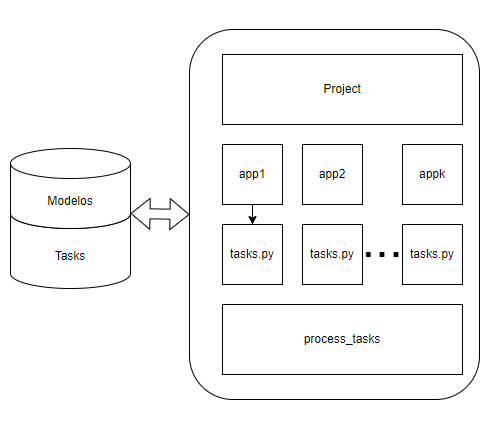

# Uso de django-background-tasks


[django-backgroud-tasks](https://django-background-tasks.readthedocs.io/en/latest/#) es una biblioteca que permite ejecutar tareas en background,  es decir se ejecutan simultáneamente junto a un proyecto Django. La documentación existente puede ser confusa, por lo que elaboré este texto para aquellos que deseen realizar algunas tareas simples de manera automática, por ejemplo: enviar recordatorios periódicos sobre el estado del sistema, copiar datos de una tabla a otra repetitivamente, o borrar aquella información que podemos considerar vieja o no útil en el sistema (archivos temporales, entradas caducas, etc.).

## Elementos principales de django-backgrund-tasks

La arquitectura del paquete se puede ilustrar en el siguiente diagrama:



En este diagrama se aprecian los elementos normales de django, pero también tres nuevos elementos: 

- Un parte de la base de datos es empleado para administrar las tareas, básicamente se crean dos nuevos modelos background_task que registra las tareas que se tienen que ejecutar y backgroud_tasks_completedtask que es un registro de las tareas que se han realizado
- las apps que quieran programar una tarea tienen ahora un archivo tasks.py 
- un process_tasks que es el responsable de ejecutar las tareas programadas (tasks.py)

## Modelos background_task 

Los modelos simplemente se crean haciendo la migración correspondiente una vez instalado el paquete en el proyecto. Cada vez que se programa una tarea (al ejecutar el process_tasks) puede verse una nueva entrada en la tabal background_task y cada vez que una tarea se ha terminado se puede observar que se retira esa entrada de la table y se envía a background_task _completedtask. Si la tarea se ha programado para repetirse cada determinado tiempo, al terminar la tarea se agrega una nueva entrada a la tabla background_task. 

## tasks.py

Un módulo de descubrimiento de tareas determina automáticamente las tareas de cada módulo, explorando los archivos tasks.py. El decorador @background identifica cada tarea, los parámetros son serializados y almacenados en la tabla background_task, por lo que debe tenerse cuidado con ello, en particular los modelos y objects, es mejor pasar el id de un modelo que pasar el modelo completo. Hay limitantes en cuanto a compartir información que no sea comunicada  por medio de parámetros, en todo caso parece que la mejor opción es comunicarse por medio de ellos o por medio de modelos dentro de la base.


## process_tasks 

Este proceso ejecuta cada tarea que este pendiente de realizarse (tomando los datos de la tabla backgroud_task). 

```sh
python manage.py process_tasks
```

process_tasks se agrega al manager una vez que instalamos django-background-tasks y es independiente de la ejecución del project, es decir, el servidor web -y por lo tanto el proyecto- puede estar detenido y el process_tasks puede estar corriendo modificando modelos y realizando tareas. 

**Si el servidor web esta ejecutándose y el process_tasks no esta corriendo entonces NO se realizará ninguna tarea**, pero si se almacenarán tareas en la tabla backgroud_task si alguna vista solicita una tarea (ver la llamada a demo_task en api/views)

## Este ejemplo

En este ejemplo se ejecutan tareas al consultare el sistema por una petición http y también de manera autónoma (sin necesidad de alguna consulta) al levantar el process_task (líneas 26 y 27 de tasks.py) 

1. Levante el servidor: python manage.py runserver
2. En otra ventana ejecute el python manage.py process_tasks
3. pruebe enviando un mensaje por post: curl -d message="Hola amigos!" http://localhost:8000/api/v1/tasks/

Observe el comportamiento del programa en la ventana donde ejecutó process_tasks, pruebe deteniendo el servidor y revise las tablas de la base de datos


